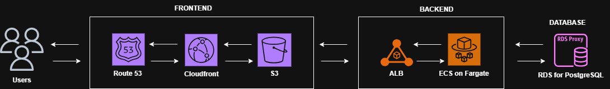

# AWS Architecture Design SaaS Platform (10K → 500K Users)

## 1 
### List every AWS service you would use and explain why you chose it
- **S3** — Serves as secure object storage. Stores the application's static assets/built frontend files, allowing CloudFront to pull and cache them directly without straining the backend.
- **CloudFront** — CDN providing fast, edge-cached responses for static content, shielding the backend from malicious traffic, and improving global latency for users in Africa, Europe, and North America.
- **ACM (AWS Certificate Manager)** — Handles creation, renewal, and management of SSL/TLS certificates, ensuring all traffic is encrypted over HTTPS.
- **Route 53** — Manages DNS records, routing initial domain requests to the load balancer/CloudFront distribution with high availability.
- **ECS on Fargate** — Runs containerized code serverlessly, abstracting away server management. Integrates directly with AWS Application Auto Scaling to grow from a handful of tasks to dozens as traffic spikes.
- **ALB (Application Load Balancer)** — Sits in the public subnet as the single point of contact for clients. Receives traffic from CloudFront/Route 53, performs SSL termination via the ACM certificate, runs health checks, and distributes requests across active Fargate tasks.
- **NAT Gateway** — Deployed in the public subnet to give Fargate tasks in the private subnet secure, outbound-only internet access (patches, external APIs) while blocking incoming probes.
- **RDS for PostgreSQL** — Fully managed relational database isolated in the private subnet, handling user profiles, application state, and transactional data with automated snapshot backups.
- **VPC** — Isolated virtual network defining public subnets (internet-accessible) and private subnets (internal-only systems).

- Show how the three components connect to each other

- Identify which components are in public vs private subnets and why

| Subnet Type | Component | Reason |
|---|---|---|
| Public | ALB (Application Load Balancer) | Helps route traffic from the internet to the different Availability Zones the containers are located in on ECS Fargate |
| Public | NAT Gateway | Acts as a secure, one-way bridge in which the application running in the container sends out traffic from the private subnet to the internet |
| Private | ECS Tasks | Keeps the containers completely invisible to the internet by giving them only private IPs, forcing all incoming traffic to safely go through the ALB first, and allowing the containers to securely connect outward via the NAT Gateway without being exposed to direct attacks |
| Private | RDS | Stores sensitive data, meaning it should never be directly accessible from the internet and should only accept secure database connections coming from your ECS containers |

## Part 2 

- Explain how the API layer scales from 10,000 to 500,000 users
To scale from 10k to 500k users we can implement some scaling strategies to handle the massive traffic increase like;
Horizontal compute scaling (ECS service auto scaling); This uses target-tracking policies like keeping CPU utilization at 60–70% or monitoring request counts to automatically launch more Fargate tasks as traffic climbs.
Load balancer traffic distribution (ALB distribution); This ensures that as the number of tasks scales up and down, the load balancer instantly registers the new containers and distributes the massive influx of user traffic evenly across them without any downtime.
Vertical database scaling; This upgrades the primary database instance class to provide more CPU and RAM, which is simple but hits a capacity ceiling and requires a brief downtime or a multi-AZ failover to apply.
Horizontal database scaling; This adds read replicas to offload read-heavy traffic like dashboards and reports from the primary instance, ensuring the primary database only handles writes to scale past the limits of a single machine.
Database connection management (RDS proxy); This introduces a connection pooling layer to combine a larger primary instance with several read replicas, preventing the rapidly expanding Fargate tasks from exhausting the database connection limits at a high scale.

- What AWS service handles auto-scaling and what metric triggers it?
Amazon ECS (Elastic Container Service) Service Auto Scaling handles this using a feature called AWS Application Auto Scaling. Amazon ECS Service Auto Scaling dynamically adjusts running container tasks using AWS Application Auto Scaling to manage workload demands without automatically. Scaling actions are triggered via Amazon CloudWatch metricssuch as CPU utilization, memory usage, ALB request counts, or SQS queue depth—using Target Tracking.

- How does the database scale? What is the difference between vertical and horizontal scaling for PostgreSQL on AWS?
Amazon RDS PostgreSQL databases do not automatically scale alongside Fargate tasks and must be managed independently using two scaling strategies:Vertical Scaling (Scale Up): Upgrades a single database instance to a larger size to increase CPU, RAM, and connection limits. This method is straightforward but causes brief downtime during modifications and hits a hard physical capacity ceiling.Horizontal Scaling (Scale Out): Adds multiple Read Replicas to distribute the workload. This strategy offloads read traffic (SELECT queries) across instances, though it cannot resolve write traffic (INSERT/UPDATE) bottlenecks and may introduce minor replication lag.

## Part 3

- How does your architecture survive an AZ failure for each component?

| Component | Reason
|---|---|
| **Frontend (S3 + CloudFront)** | Operates globally, S3 replicates data across multiple AZs by default, and CloudFront serves content through a worldwide network of edge locations independent of any single AZ. |
| **API (ECS on Fargate + ALB)** | Fargate tasks run across multiple AZs, and the ALB continuously health-checks them. If an AZ fails, the ALB reroutes traffic to healthy tasks in the remaining zone automatically. |
| **Database (RDS Multi-AZ)** | RDS maintains a synchronous standby replica in a second AZ. On primary or AZ failure, RDS auto-fails over and updates DNS so the standby takes over as writer with minimal disruption. |

- What is the RTO and RPO for your database in a failure scenario?
For Amazon RDS for PostgreSQL, the Recovery Time Objective (RTO) measures the downtime window with a 1 to 2-minute disruption during automated DNS failover in a Multi-AZ deployment, while the Recovery Point Objective (RPO) defines acceptable data loss, yielding zero data loss under synchronous replication. For production workloads, deploying a Multi-AZ primary instance alongside Read Replicas and an AWS RDS Proxy ensures connection pooling is managed safely.

- How does Multi-AZ RDS differ from a Read Replica?
Multi-AZ RDS acts as an exact, live clone of your database sitting in a separate data center (Availability Zone). It runs synchronously to guarantee zero data loss and will automatically take over in 1 to 2 minutes if your main database goes offline, but you cannot use it to run queries while it is on standby.Read Replicas, on the other hand, are active copies of your database that operate asynchronously. They are designed to offload heavy read traffic (SELECT queries) from your primary instance, but they do not provide automated high-availability failover and carry a minor risk of data loss due to replication lag during a sudden crash.

**RTO/RPO:**

For RDS PostgreSQL, RTO is a 1–2 minute disruption during automated DNS failover in a Multi-AZ deployment, while RPO is zero data loss under synchronous replication. For production workloads, a Multi-AZ primary alongside Read Replicas and RDS Proxy ensures connection pooling is managed safely.

**Multi-AZ RDS vs Read Replica:**

Multi-AZ RDS is an exact, live clone in a separate AZ, running synchronously to guarantee zero data loss, automatically taking over in 1–2 minutes if the main database fails — but it can't be queried while on standby. Read Replicas are active, asynchronous copies designed to offload read traffic, but don't provide automated failover and carry a minor risk of data loss from replication lag during a sudden crash.

## Part 4 
- Estimate the monthly cost at launch (low traffic) using at least 3 specific AWS services
**Launch cost (~10,000 users, low traffic):**

- ECS Fargate (2 small tasks): ~$30/month
- RDS Multi-AZ (db.t3.micro/small): ~$60–80/month
- ALB: ~$20/month base
- S3 + CloudFront: ~$10–20/month
- NAT Gateway: ~$35/month
- Route 53 + ACM: ~$1/month

**Total at launch: roughly $150–250/month.**

- Identify 2 cost optimisation strategies you would apply
1. Use Compute Savings Plans or Reserved Instances for the RDS instance once traffic is predictable (1-year commitment can cut ~30–40%).
2. Use CloudFront caching aggressively to cut origin requests and reduce data transfer costs.

- What would change in the architecture if the budget doubled?
**If budget doubled:** Add more read replicas, upgrade RDS instance class further, add redundant NAT Gateways per AZ, expand RDS Proxy usage, and consider AWS WAF on CloudFront/ALB for added protection.

## Part 5 — Security
- How do you prevent the database from being directly accessible from the internet?
RDS is placed in private subnets with no public IP and configured with a security group that only allows inbound traffic on port 5432 from the application running in the container.

- What IAM strategy do you use for the API containers to access other AWS services?
Create an IAM Role for the ECS task granting only the specific permissions it needs (e.g., read a specific S3 bucket, write to Secrets Manager) following least privilege. Also Database credentials should be stored in Secrets Manager and rotated automatically.

- How do you manage SSL/TLS certificates for the API endpoint?
ACM (AWS Certificate Manager) issues and auto-renews certificates for both CloudFront and the ALB. All traffic requests are enforced over TLS, satisfying the encryption-in-transit requirement end-to-end.